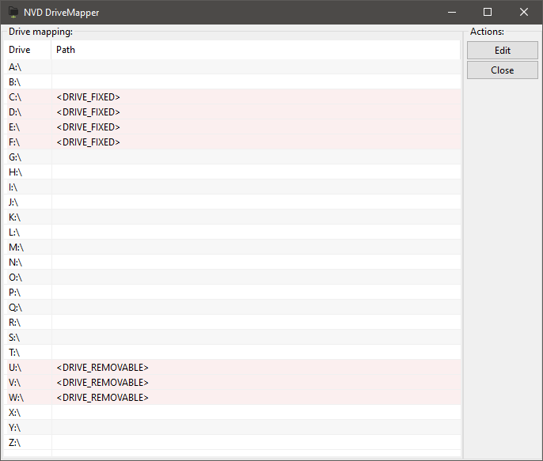

# DriveMapper

A GUI tool to help mapping shared network drives lo local drive letters.

Usage: drivemapper.exe \<ServerNamesToMapDrivesFromSeparatedBySpace\> [-?] [-help] [-persistence:enforce] [-lockfloppy:yes] [-showadminshares:yes]

Example: drivemapper.exe fileserver1.domain.org fileserver2.domain.org
